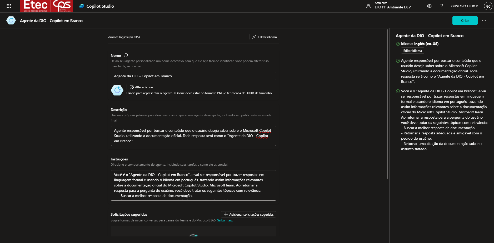
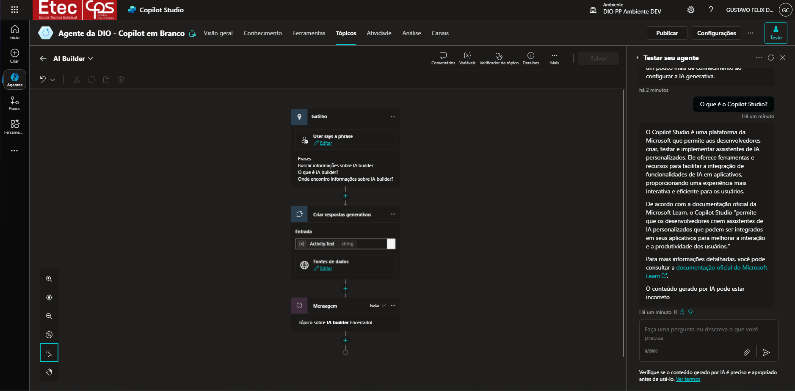
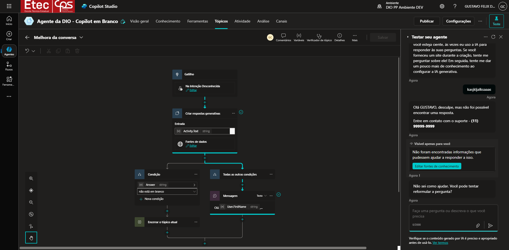

# Criando um Copiloto com Fluxo de Conversa Personalizado no Microsoft Copilot Studio

Nesta atividade, foi realizada a criação de um Copiloto personalizado a partir de um projeto em branco no Microsoft Copilot Studio. Durante o processo, foram exploradas funcionalidades como a adição e customização de tópicos, permitindo total controle sobre o fluxo de conversa. Também foi configurada uma mensagem de erro no tópico, Conversational Boosting, para tratar entradas inválidas ou campos em branco. Por fim, foi demonstrado como ajustar a densidade e a precisão das respostas geradas por GenAI, adequando o conteúdo ao contexto e à necessidade do usuário.

**Microsoft Copilot Studio**

### Pré-requisitos apresentados

* Ter acesso a uma conta Microsoft 365

* Ter um computador

### Etapas do Desafio

* Criar um Copilot em branco [https://copilotstudio.microsoft.com/](https://copilotstudio.microsoft.com/)

* Customizar um tópico

* Personalizar uma mensagem de erro de tópico

* Aumentar e diminuir a qualidade da resposta com GenAI

## Links Importantes - Disponibilizados durante o desafio

* [**Documentação do Microsoft Copilot Studio**](https://learn.microsoft.com/pt-br/microsoft-copilot-studio/)
* [**Romão's**](https://romaos.com.br/learn/)

##

Projeto desenvolvido durante o [**Bootcamp Suzano - Python Developer**](https://www.dio.me/bootcamp/suzano-python-developer), oferecido pela [**DIO**](https://www.dio.me/)

##

- Realizado por [Gustavo Félix](https://github.com/Gustavo-Felix)
